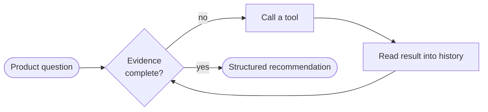

# Product Discovery Agent

**What it solves:** product decisions frequently get made on opinion, the
loudest stakeholder, or a single anecdote, instead of evidence.

**What the agent does:** given a feature question ("Should we build dark
mode?"), it plans what evidence it needs, calls local tools to gather that
evidence one piece at a time, decides whether it has enough, and only then
produces a structured, schema-validated recommendation - never a snap
judgment.

**What the agentic loop demonstrates:** a model deciding *what it doesn't
know yet*, calling a tool to find out, reading the result back into its own
memory, and repeating until it has enough to answer - the core mechanic
behind every real tool-using AI agent, shown here without hiding any of it.



**One example result:** asking *"Should we build dark mode?"* leads the
agent through customer feedback, usage analytics, competitor research,
effort estimation, and risk checking, and produces:

```json
{
  "feature": "dark mode",
  "recommendation": "Build now",
  "confidence": "High",
  "executive_summary": "For 'dark mode': there is meaningful customer demand; usage analytics offer a related (correlational, not causal) signal; estimated engineering effort is medium; identified risk levels include Low. Based on this evidence, the suggested next step is: build now."
}
```

(Full output: [examples/dark_mode_output.json](examples/dark_mode_output.json))

**How to run the demo:**

```bash
pip install -r requirements.txt
python app.py --scenario dark-mode
```

No API key, database, or network access required.

**Module 2 (new):** the same question can also be run through a
**hub-and-spoke coordinator** that delegates customer, market, technical, and
risk research to four isolated specialist subagents and aggregates their
findings into one decision brief:

```bash
python app.py --mode coordinator --scenario dark-mode
```

See [Module 2: Hub-and-Spoke Product Discovery](#module-2-hub-and-spoke-product-discovery) below.

**Live mode (new):** the same loop can also run for real - a real LLM
(via [OpenRouter](https://openrouter.ai)) deciding for itself which tools to
call, backed by real web search (customer reviews, competitor adoption)
instead of any synthetic data:

```bash
echo "OPENROUTER_API_KEY=your-real-key" > .env   # never commit this file
python app.py --mode live --question "Should we add a Slack integration?"
```

See [Live Mode: Real LLM + Real Web Search](#live-mode-real-llm--real-web-search)
below - this one costs a small amount per run and results vary between runs,
unlike the free, deterministic modes above.

---

## Table of contents

- [Project overview](#project-overview)
- [Business problem](#business-problem)
- [Solution](#solution)
- [The agentic loop](#the-agentic-loop)
- [Architecture](#architecture)
- [Example workflow: dark mode, start to finish](#example-workflow-dark-mode-start-to-finish)
- [Failure scenarios](#failure-scenarios)
- [Module 2: Hub-and-Spoke Product Discovery](#module-2-hub-and-spoke-product-discovery)
- [Live Mode: Real LLM + Real Web Search](#live-mode-real-llm--real-web-search)
- [Installation](#installation)
- [Usage](#usage)
- [Testing](#testing)
- [Evaluation](#evaluation)
- [Example output](#example-output)
- [Product-management value](#product-management-value)
- [Limitations](#limitations)
- [Future improvements](#future-improvements)
- [Metrics for future real-world evaluation](#metrics-for-future-real-world-evaluation)
- [Interview talking points](#interview-talking-points)
- [Portfolio Case Study](#portfolio-case-study)
- [What I learned](#what-i-learned)

## Project overview

The Product Discovery Agent is a local, terminal-based AI agent that helps a
product manager evaluate a feature idea. It is the first project in a
portfolio series about how reliable AI agents are designed - specifically,
it demonstrates that an agent is more than a chatbot: it can reason about
what information it's missing, take actions (tool calls) to get it, observe
the results, and keep going until it has enough evidence to answer
responsibly.

It runs entirely offline on deterministic mock logic and local JSON data, so
the full workflow - including failure handling and edge cases - is
reproducible every single run.

## Business problem

Product managers constantly receive feature requests from customers,
executives, sales, and competitors. Without a consistent process, these get
evaluated on incomplete information or personal opinion, which leads to:

- Building features few users actually need.
- Prioritizing the loudest stakeholder over real customer evidence.
- Ignoring technical complexity until it's too late.
- Missing usability problems that a feature request is actually a symptom of.
- Shipping without any measurable definition of success.

The agent doesn't replace the product manager's judgment - it makes sure
that judgment is exercised on top of organized evidence instead of a blank
page.

## Solution

Given a feature question, the agent:

1. Plans what categories of evidence are relevant (customer demand, usage
   data, competitive landscape, engineering effort, risk/compliance).
2. Calls local tools to gather that evidence, one or two at a time.
3. Reads each tool result back into a structured message history.
4. Re-evaluates what's still missing and decides whether to call another
   tool, retry a failed one, or stop.
5. Produces a structured recommendation with an explicit confidence level,
   assumptions, limitations, next steps, and proposed success metrics -
   never a bare "yes, build it."

## The agentic loop

At the center of the project is one control-flow shape ([src/loop.py](src/loop.py)):

```python
while iteration < max_iterations:
    response = model.respond(message_history)

    if response.stop_reason == "tool_use":
        append_assistant_response_to_history(response)
        execute_requested_tools(response)
        append_tool_results_to_history()
        continue

    if response.stop_reason == "end_turn":
        return final_response

    handle_unknown_stop_reason()
```

Concretely, in this project:

- **Model response** - [src/mock_model.py](src/mock_model.py)'s `MockModel.respond()` looks at
  the current `EvidencePlan` and deterministically decides what to do next.
  No network call, no randomness - the same question always produces the
  same evidence-gathering path.
- **`stop_reason`** - one of `tool_use`, `end_turn`, or an unsupported value
  (used to test safe failure handling).
- **`tool_use`** - the model is missing evidence and requests one or more
  tool calls in a single turn.
- **Tool execution** - [src/agent.py](src/agent.py)'s `_on_tool_use` calls
  the requested tool(s) through the tool router ([src/tools/__init__.py](src/tools/__init__.py)),
  applying a one-retry policy on failure.
- **Tool result** - each execution produces a `ToolResult` (success or
  failure) that gets appended to the message history - *this step is never
  skipped* in normal operation, which is exactly what "Bug mode 1" below
  breaks on purpose to demonstrate why it matters.
- **History update** - [src/history.py](src/history.py) is the single
  append-only source of truth for everything that happened in the run.
- **Continued loop** - if evidence is still outstanding, the loop calls the
  model again with the updated plan; this can happen many times, and can
  also involve two or more tools in a single response (dark mode's first
  iteration always requests customer feedback *and* analytics together).
- **`end_turn`** - only returned once the evidence plan is complete (or
  everything outstanding has permanently failed after a retry); the agent
  then generates the final structured recommendation.

## Architecture

Full details, a Mermaid flowchart, and a Mermaid sequence diagram (showing
two tool calls before the final answer) live in
[docs/architecture.md](docs/architecture.md) / [docs/architecture.mmd](docs/architecture.mmd).
Short version:

```
User → Product Discovery Agent → Evidence Planner → Agentic Loop →
Tool Router → Local Product Tools → Tool Results → Message History →
Continue or Stop Decision → Structured Recommendation
```

## Example workflow: dark mode, start to finish

```bash
python app.py --scenario dark-mode
```

1. Question: *"Should we build dark mode?"*
2. Evidence plan: customer_feedback, product_analytics, competitor_research,
   engineering_effort, risks.
3. Iteration 1: no evidence yet -> calls **customer feedback search** and
   **product analytics lookup** together (two tools, one iteration).
   - Feedback: 42 matching requests, night-shift/enterprise segment
     over-represented, pain point "eye strain."
   - Analytics: 22% of sessions happen at night, with a higher (but
     explicitly correlational, not causal) abandonment rate.
4. Iteration 2: demand and usage evidence established -> calls
   **competitor research**. Two of three tracked (fictional) competitors
   offer dark mode.
5. Iteration 3: -> calls **engineering effort estimator**. Effort: Medium,
   confidence Medium, clearly labeled as a teaching-purpose estimate.
6. Iteration 4: -> calls **risk and compliance checker**. One Low
   accessibility risk, no human approval required.
7. Iteration 5: evidence plan complete -> `end_turn` -> structured
   recommendation: **Build now / High confidence**, with proposed success
   metrics such as "percentage of active users enabling dark mode" and
   "change in evening-session abandonment."

Full recorded output: [examples/dark_mode_output.json](examples/dark_mode_output.json)
and [examples/sample_trace.json](examples/sample_trace.json).

## Failure scenarios

All of these are runnable, not theoretical:

| Scenario | Command | What happens |
|---|---|---|
| Missing tool-result history (**bug mode 1**) | `python app.py --scenario dark-mode --bug-mode skip-tool-history --max-iterations 4` | The tool runs, but its result is deliberately never appended to history or evidence state. The agent re-requests the same tool every iteration, makes no progress, and hits the iteration cap with an "Insufficient evidence" result. |
| Ending the loop too early (**bug mode 2**) | `python app.py --scenario dark-mode --bug-mode end-too-early` | The loop stops after the very first tool call instead of feeding the result back to the model. Only one of five evidence types is ever collected, producing a low-confidence, incomplete recommendation. |
| Unknown stop reason | `python app.py --scenario dark-mode --demo-unknown-stop-reason` | The simulated model returns an unsupported `stop_reason` on iteration 2. The loop halts safely with a clear error instead of crashing or guessing. |
| Tool failure (with recovery) | `python app.py --scenario dark-mode --demo-failure competitor_research` | The first attempt at that tool is forced to fail transiently; the agent records the failure, retries once, and the retry succeeds. |
| Maximum iteration protection | `python app.py --scenario dark-mode --max-iterations 2` | The evidence plan needs five iterations to complete; capping it at 2 forces the loop to stop with `max_iterations_reached` instead of running forever. |
| Insufficient evidence | `python app.py --scenario unknown-feature` | The question doesn't match any feature in the synthetic datasets, so every tool call fails after a retry. The recommendation is `Insufficient evidence` / `Low` confidence. |

## Module 2: Hub-and-Spoke Product Discovery

Module 1 shows how **one agent** completes a multi-step task by looping on
tool calls. Module 2 shows how a **coordinator** manages **multiple
specialist subagents** that each own one slice of a product decision -
customer demand, market positioning, technical feasibility, and risk/metrics
- and never talk to each other directly.

```bash
python app.py --mode coordinator --scenario dark-mode
```

### What the hub-and-spoke model is

A hub-and-spoke architecture has one central coordinator (the hub) and
several independent specialists (the spokes) that only communicate through
the hub, never with each other. The coordinator decides *what* work is
needed and *who* does it; each specialist only knows its own narrow task.

### Why the coordinator is the hub

`ProductDiscoveryCoordinator` ([src/coordinator/coordinator.py](src/coordinator/coordinator.py))
is the only component that sees the whole picture: it decomposes the
question, builds each subagent's context, invokes them, validates what comes
back, and aggregates it into one brief. No subagent can see another
subagent's result or call another subagent directly - every result flows
back through the coordinator first.

### Why specialist agents are the spokes

Each spoke ([src/subagents/](src/subagents/)) owns one evidence category and
is authorized to call exactly one or two of Module 1's existing tools -
never all five:

| Subagent | Authorized tool(s) | Cannot use |
|---|---|---|
| Customer Insights | `customer_feedback_search`, `product_analytics_lookup` | engineering estimator, competitor research, risk checker |
| Market Research | `competitor_research` | customer feedback, engineering estimator, risk checker |
| Technical Feasibility | `engineering_effort_estimator` | customer feedback, competitor research, risk checker |
| Risk and Metrics | `risk_compliance_checker` | customer feedback, competitor research, engineering estimator |

Calling an unauthorized tool raises a structured `ToolNotAuthorizedError`
([src/subagents/base.py](src/subagents/base.py)) instead of silently
succeeding or crashing - see [tests/test_subagent_tool_scoping.py](tests/test_subagent_tool_scoping.py).

### How the coordinator decomposes work

`TaskDecomposer` ([src/coordinator/task_decomposer.py](src/coordinator/task_decomposer.py))
always creates a Customer Insights task (every feature decision needs demand
evidence) and always creates Technical Feasibility and Risk/Metrics tasks,
but **skips Market Research** for low-risk copy/wording changes - the
coordinator does not blindly invoke all four agents every time:

```bash
python app.py --mode coordinator --scenario onboarding-copy --show-task-plan
```

### How context is passed explicitly

`ContextPackageBuilder` ([src/coordinator/context_builder.py](src/coordinator/context_builder.py))
builds a different, narrow `ContextPackage` per task. The Customer Insights
agent gets `target_users` and a `known_problem` string but no `platforms`;
the Technical Feasibility agent gets `platforms` but no customer data. Run
this to see it directly:

```bash
python app.py --mode coordinator --scenario dark-mode --show-subagent-context
```

```text
Customer Insights Agent received:
- Feature: dark mode
- Target users: ['Enterprise users', 'SMB users', 'Individual users']
- Known customer problem: Some users report eye strain during evening sessions.
- Customer feedback + product analytics data access
Customer Insights Agent did not receive:
- Competitor research data
- Engineering rules data
- Risk and compliance rules data
- Results from other agents
- Coordinator internal history
```

### Why subagents do not inherit coordinator memory

`ContextPackage` ([src/coordinator/models.py](src/coordinator/models.py)) has
no field for "coordinator history" or "other agents' results" - structurally,
not just by convention, so there is nothing to accidentally leak. A subagent
only ever sees its task, its context package, and its authorized tools (see
[tests/test_context_isolation.py](tests/test_context_isolation.py)).

### How results are aggregated

`ResultValidator` ([src/coordinator/result_validator.py](src/coordinator/result_validator.py))
downgrades a result to `partial` if required fields are missing, and strips
any data a `failed` result tries to smuggle in (no fabricated findings).
`ResultAggregator` ([src/coordinator/result_aggregator.py](src/coordinator/result_aggregator.py))
then combines the validated results into one `DecisionBrief` - explainable,
rule-based confidence and recommendation logic, not an average of four
separate opinions. It also detects simple contradictions (e.g. high customer
demand alongside high engineering effort) and surfaces them instead of
quietly picking a side.

### How failures affect confidence

| Failure mode | Command | Coordinator behavior |
|---|---|---|
| Subagent execution failure | `python app.py --mode coordinator --scenario dark-mode --failure-agent market_research` | Failure recorded, no fabricated competitor data, other agents' results still used, confidence reduced, `market_research` listed in `failed_agents`. |
| Missing required context | `python app.py --mode coordinator --scenario dark-mode --missing-context-agent technical_feasibility` | `MissingContextError("platforms")` raised, coordinator supplies a safe fallback platform list and retries once (recorded as a `retry_attempted` event); only fails permanently if no safe fallback exists. |
| Unregistered/unknown agent | test-only, via dependency injection - see [tests/test_coordinator_failures.py](tests/test_coordinator_failures.py) | Structured `UnknownAgentError`, no crash; the run stops safely if the missing agent was critical, or continues if it wasn't. |
| All subagents fail | `python app.py --mode coordinator --scenario unknown-feature` | `recommendation: "Insufficient evidence"`, `confidence: "Low"`, `human_decision_required: true`. |

### How incomplete output is diagnosed

Every result carries `status` (`success` / `partial` / `failed` / `skipped`),
`limitations`, and `missing_information`. The aggregator turns these directly
into the brief's `evidence_gaps` list, so a reader can see *exactly* which
agent came up short and why - never a silent gap.

### How Module 2 builds on Module 1

The coordinator reuses Module 1's tools, feature resolution
(`agent.resolve_feature`), and platform/risk-context lookups
(`mock_model.FEATURE_PLATFORMS`, `FEATURE_RISK_CONTEXT`) directly - nothing
about evidence gathering was rebuilt from scratch. Module 1's agentic loop
(`src/loop.py`, `src/agent.py`) is completely untouched and still runs via
`--mode single-agent` (the default).

| Module 1 | Module 2 |
|---|---|
| One agent | Coordinator with specialist agents |
| One message history | Coordinator event trace + per-task context packages |
| Tool selection inside one loop | Task delegation across agents |
| Single-agent failure handling | Partial subagent failure handling |
| One final response | Aggregated multi-agent decision brief |

Full architecture diagrams (flowchart, sequence diagram, and a failure-path
diagram) are in [docs/architecture.md](docs/architecture.md).

## Live Mode: Real LLM + Real Web Search

Modules 1 and 2 above are deliberately offline and deterministic - free to
run, reproducible on every call, and safe to test in CI. **Live mode** is the
same tool-use shape wired to the real world instead: a real LLM decides for
itself which tools to call, and every tool result comes from a live web
search - no synthetic JSON anywhere.

```bash
echo "OPENROUTER_API_KEY=your-real-key" > .env   # gitignored - never commit a real key
python app.py --mode live --scenario dark-mode
python app.py --mode live --question "Should we add a Slack integration to our project management tool?"
python app.py --mode live --question "..." --save-trace output/live-transcript.json
```

### How it's different from Modules 1 and 2

| | Modules 1 & 2 (mock) | Live mode |
|---|---|---|
| Model | `MockModel` - deterministic, rule-based, no network | Real LLM via [OpenRouter](https://openrouter.ai) (`anthropic/claude-haiku-4.5` by default), deciding tool calls itself |
| Data | Local synthetic JSON (`data/*.json`) | Real web search results (`perplexity/sonar-pro` via OpenRouter), fetched live per run |
| Cost | Free | Costs a small amount per run (OpenRouter billing) |
| Reproducibility | Identical output every run | Output varies run to run, like any real LLM + live search |
| Requires | Nothing | `OPENROUTER_API_KEY` in a local `.env` |
| Tested by | 92 offline pytest tests | 10 offline unit tests on parsing/schema/dispatch only (`tests/test_live_mode.py`) - no test makes a real network call |

### Architecture

- [`src/llm/openrouter_client.py`](src/llm/openrouter_client.py) - the only
  place that talks to the network. `chat()` drives the agent's real
  tool-calling loop; `search()` is a web-search-grounded call used inside
  each live tool.
- [`src/live_tools/`](src/live_tools/) - four tools, each making a real
  `search()` call: `customer_feedback_search` (real reviews/forum
  sentiment), `competitor_research` (real named competitors),
  `engineering_effort_estimate` (grounded by how this class of feature is
  typically built - not a lookup against any real codebase),
  `risk_and_metrics_check` (real regulatory/accessibility considerations
  plus proposed metrics).
- [`src/live_agent.py`](src/live_agent.py) - the loop itself: same shape as
  Module 1 (`tool_use` -> execute -> append result -> continue; otherwise ->
  final answer), but the model - not scripted logic - decides when it has
  enough evidence, and can call multiple tools in one turn on its own.

### What's still honest about its limits

- There is no real internal analytics or support-ticket data source
  connected - `customer_feedback_search` searches **public** reviews and
  forums only, and says so in every result.
- `engineering_effort_estimate` is real LLM reasoning grounded by public
  discussion of similar features, not an assessment of any specific
  company's actual codebase - every result states this explicitly.
- Web search results and LLM judgment can be wrong, incomplete, or
  contradictory between runs, same as asking any human researcher to
  search the web on short notice. `human_decision_required` is always
  `true` here too.

## Installation

```bash
git clone <this-repository>
cd product-discovery-agent
python3 -m venv .venv
source .venv/bin/activate
pip install -r requirements.txt
```

## Usage

```bash
# Run one of the five built-in feature scenarios
python app.py --scenario dark-mode
python app.py --scenario mobile-app
python app.py --scenario ai-meeting-summary
python app.py --scenario onboarding
python app.py --scenario export-pdf

# Type your own question
python app.py --interactive

# Print the full structured history trace at the end
python app.py --scenario dark-mode --show-history

# Save the full trace to a JSON file
python app.py --scenario dark-mode --save-trace output/trace.json

# Failure and edge-case demonstrations
python app.py --scenario dark-mode --demo-failure competitor_research
python app.py --scenario dark-mode --demo-unknown-stop-reason
python app.py --scenario dark-mode --max-iterations 2
python app.py --scenario unknown-feature

# Intentional bug modes (educational comparison)
python app.py --scenario dark-mode --bug-mode skip-tool-history
python app.py --scenario dark-mode --bug-mode end-too-early

# --- Module 2: hub-and-spoke coordinator ---

python app.py --mode coordinator --scenario dark-mode
python app.py --mode coordinator --scenario mobile-app
python app.py --mode coordinator --scenario dark-mode --show-subagent-context
python app.py --mode coordinator --scenario dark-mode --show-task-plan
python app.py --mode coordinator --scenario onboarding-copy --show-task-plan   # Market Research is skipped
python app.py --mode coordinator --scenario dark-mode --failure-agent market_research
python app.py --mode coordinator --scenario dark-mode --missing-context-agent technical_feasibility
python app.py --mode coordinator --scenario unknown-feature                   # all subagents fail
python app.py --mode coordinator --scenario dark-mode --save-trace output/coordinator-trace.json

# --- Live mode: real LLM + real web search (needs OPENROUTER_API_KEY in .env) ---

python app.py --mode live --scenario dark-mode
python app.py --mode live --question "Should we add a Slack integration to our project management tool?"
python app.py --mode live --question "..." --quiet --save-trace output/live-transcript.json
```

Run `python app.py --help` for the full flag list.

## Testing

```bash
pip install -r requirements.txt
python -m pytest tests/ -v
```

92 tests across twelve files, all free and offline (live mode's own tests
only check JSON parsing, schema shape, and dispatch wiring - never a real
network call). The original 35 (five files) cover Module 1's
loop mechanics, structured history, all five tools, recommendation schema
validation, tool failure/retry handling, both bug modes, the iteration cap,
unknown stop reasons, and a static scan for accidental secrets or
sensitive-data patterns - **unchanged and still passing**. 47 new tests
(six files) cover Module 2: task decomposition, context isolation, per-agent
tool authorization, result validation, retry policy, aggregation/confidence/
contradiction logic, and full coordinator success/failure/schema/trace-export
paths. 10 new tests (one file, `test_live_mode.py`) cover live mode's JSON
extraction, tool-schema shape, and dispatch wiring.

## Evaluation

```bash
python evaluate.py
```

A local, simulated evaluation harness runs the coordinator against 12
synthetic product questions (including copy-change, unresolvable-feature,
subagent-failure, and missing-context cases) and checks: schema validity,
whether the right agents were selected or skipped, whether failure scenarios
were handled correctly, whether evidence gaps were surfaced, whether success
metrics were present, and whether any unsupported ("guaranteed", "will
increase revenue", ...) claims leaked into the output. Every number this
script prints is a **local simulated evaluation result** on synthetic data -
not a measurement of real product outcomes.

## Example output

Shortened terminal trace (full version in
[examples/dark_mode_run.txt](examples/dark_mode_run.txt)):

```
========================================================================
PRODUCT QUESTION: Should we build dark mode?
========================================================================
EVIDENCE PLAN: customer_feedback, product_analytics, competitor_research, engineering_effort, risks
------------------------------------------------------------------------

ITERATION 1/8 | evidence still required: customer_feedback, product_analytics, competitor_research, engineering_effort, risks
  reasoning: No evidence collected yet. The agent will now call customer feedback search and product analytics lookup, since both are independent evidence sources needed before deeper analysis.
  selected tool: customer_feedback_search
  tool output status: OK
  another iteration required: True
  selected tool: product_analytics_lookup
  tool output status: OK
  another iteration required: True

ITERATION 2/8 | evidence still required: competitor_research, engineering_effort, risks
  reasoning: Established so far: customer demand, product usage evidence. Competitor positioning is still unknown ...
  selected tool: competitor_research
  tool output status: OK
...
STOP REASON: end_turn
  Evidence collection complete. Producing the structured recommendation.
```

Structured result (abridged, full version in
[examples/dark_mode_output.json](examples/dark_mode_output.json)):

```json
{
  "feature": "dark mode",
  "recommendation": "Build now",
  "confidence": "High",
  "executive_summary": "For 'dark mode': there is meaningful customer demand; usage analytics offer a related (correlational, not causal) signal; estimated engineering effort is medium; identified risk levels include Low. Based on this evidence, the suggested next step is: build now.",
  "success_metrics": [
    "Percentage of active users who enable dark mode within 30 days (proposed)",
    "Change in evening-session duration after release (proposed)",
    "Change in evening-session abandonment rate after release (proposed)"
  ],
  "human_decision_required": true
}
```

## Product-management value

- **Feature prioritization** - replaces gut-feel scoring with a repeatable,
  explainable evidence-to-recommendation path.
- **Product discovery** - models the "what do I need to know before I
  decide" step that's often skipped under deadline pressure.
- **Customer research** - shows how to aggregate scattered feedback into
  segment-level demand signals instead of anecdotes.
- **Roadmap planning** - the confidence level and `human_decision_required`
  flag make it clear when a recommendation is roadmap-ready versus still
  needing validation.
- **Experiment design** - the proposed success metrics for each feature are
  a starting point for defining what "success" would actually look like.
- **Risk identification** - surfaces accessibility, privacy, security, and
  legal considerations before they become late-stage surprises.

## Limitations

- In `--mode single-agent` / `--mode coordinator` (the default, free,
  reproducible modes), the model is **simulated** (deterministic mock
  logic) and all data is **synthetic** - see below for what changes in
  `--mode live`.
- All synthetic customer feedback, analytics, competitor, effort, and risk
  data used by the mock modes is fabricated for teaching purposes; it does
  not describe any real product, company, or customer.
- Engineering effort estimates (in every mode) are **relative and
  illustrative**, not real production commitments - live mode's estimate is
  grounded by public discussion of similar features, not your actual code.
- Recommendations are **decision support, not decision-making** in every
  mode - they do not replace a human product manager's judgment, and
  `human_decision_required` is always `true` for that reason.
- **Live mode specifically:** results vary between runs (it's a real LLM
  making real web searches, not a deterministic function); customer feedback
  comes from public reviews/forums only, never a real support-ticket system;
  and each run costs a small amount of real money via OpenRouter billing.
- A real deployment would require additional data integrations (e.g. a real
  analytics warehouse, real support-ticket export), monitoring, evaluation
  datasets, security review, and governance well beyond what this demo needs.
- **Module 2 specifically:** subagents run sequentially, not in parallel
  (parallel execution is intentionally left for a future module); the retry
  policy only knows how to recover from one specific missing-context case
  (a missing `platforms` field); and contradiction detection is a small,
  hand-written rule set, not a general-purpose reasoning step.

## Future improvements

- Connect the live customer-feedback tool to a real feedback platform (e.g.
  a support/CRM export) instead of public web search only.
- Connect a live analytics tool to a real product analytics warehouse
  (Amplitude, Mixpanel, PostHog, etc.) - not yet built in live mode.
- Add human approval checkpoints before a recommendation is considered final.
- Add an evaluation dataset and scoring harness to measure recommendation
  quality over time (beyond `evaluate.py`'s current schema/selection checks).
- Add tool-call monitoring/observability (latency, error rates, retry counts,
  and real OpenRouter cost per run).
- ~~Add a real API adapter behind an environment variable~~ - **done**: see
  [Live Mode](#live-mode-real-llm--real-web-search) (`src/llm/openrouter_client.py`).
  A remaining step is a direct Anthropic API adapter as an alternative to OpenRouter.
- Add confidence calibration informed by how often past recommendations at
  a given confidence level turned out to be right.
- Add a lightweight web interface on top of the same agent/loop code.
- Add parallel subagent execution now that the sequential hub-and-spoke
  structure is in place (a natural Module 3).
- Broaden the retry policy beyond the one missing-context case it currently
  handles, and add a real transient-vs-permanent failure classifier.

## Metrics for future real-world evaluation

The metrics below describe how this approach *could* eventually be evaluated
against a real product-management workflow. None of these have been
measured - there is no real usage to measure yet - and nothing here should
be read as a claim that they have already improved.

- Time required to prepare a feature decision brief, with vs. without the
  coordinator.
- Percentage of expected evidence categories included in each brief.
- Number of missing evidence gaps correctly detected vs. missed.
- Number of unsupported claims found in generated briefs.
- Number of subagent failures handled correctly (no crash, no fabrication).
- Product manager review score (would this brief have changed a real
  decision, and was it trusted?).
- Recommendation consistency across repeated runs of the same question.
- Percentage of generated briefs that required manual correction before use.

## Portfolio Case Study

### Problem

Product feature decisions require evidence from several business and
technical areas - customer demand, market/competitive context, engineering
feasibility, and risk - that are usually scattered across different tools,
teams, and mental models.

### Solution

A coordinator delegates focused research tasks to specialist agents, each
scoped to one evidence category and one or two tools, and combines their
validated results into one structured decision brief - including what's
missing, what contradicts what, and where a human still needs to decide.

### My role

- How I defined the workflow:
- How I selected the specialist roles:
- How I defined context boundaries:
- How I designed failure handling:
- How I evaluated output completeness:

### What this project demonstrates

- Multi-agent orchestration (hub-and-spoke, not direct agent-to-agent chat)
- Task decomposition based on the actual question, not a fixed sequence
- Explicit, isolated context management per agent
- Tool scoping and enforced authorization boundaries
- Partial-failure handling without fabricated evidence
- Structured, schema-validated output
- Product decision support (not automated decision-making)

## What I learned

- What I learned about tool-use loops:
- Why message history matters:
- Why stopping conditions matter:
- How product requirements affect agent behavior:
- How I would improve this project for production:
- What I learned about multi-agent (hub-and-spoke) orchestration:
- Why explicit context boundaries matter between agents:
- How I would extend this toward parallel execution (Module 3):
