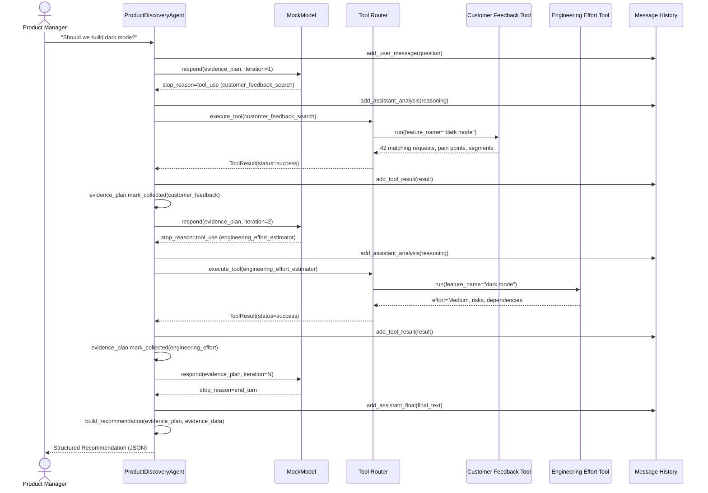
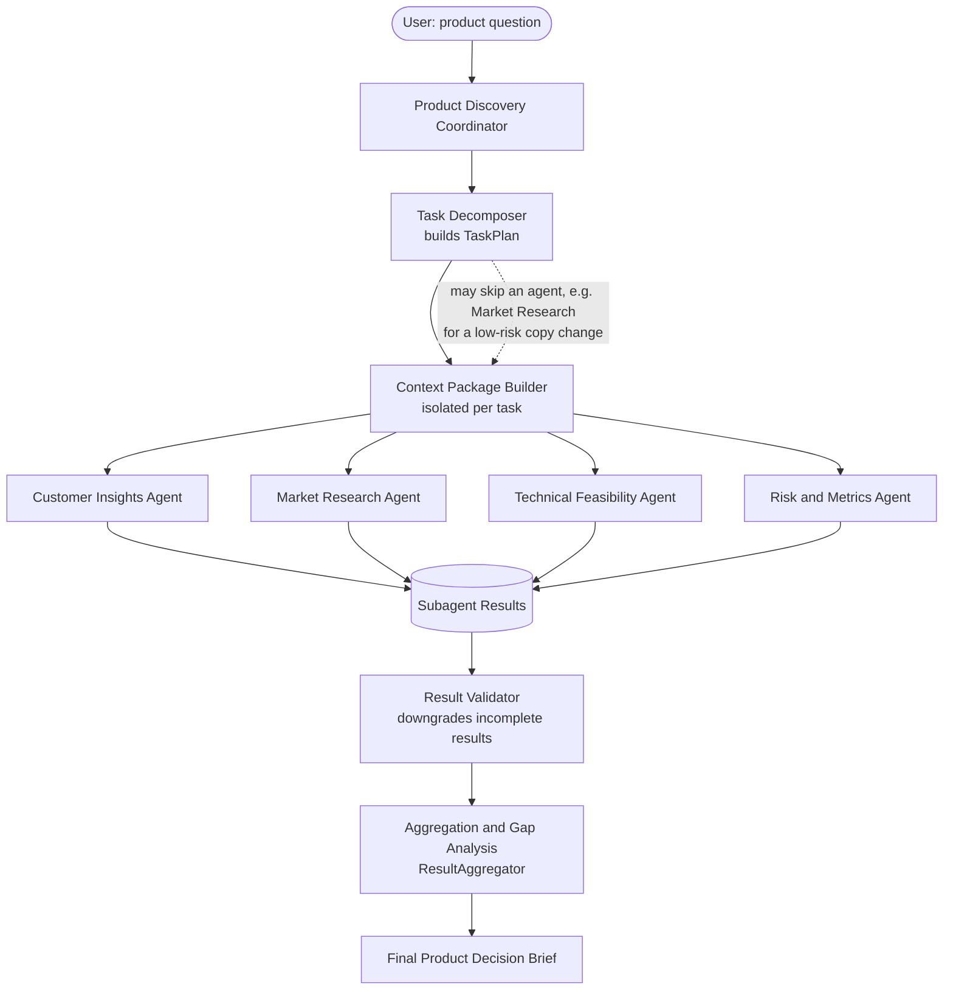
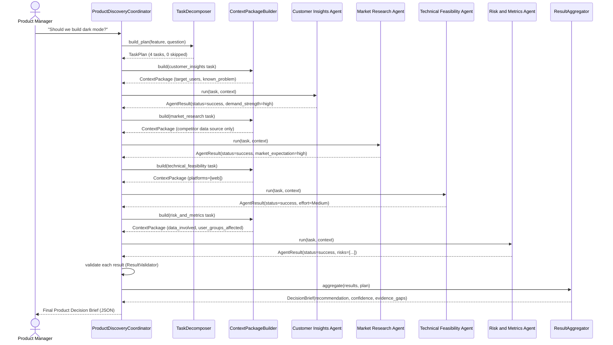

# Architecture

The Product Discovery Agent is built around one idea: **a recommendation is
only as good as the evidence behind it**. Every module in this project exists
to make that evidence-gathering process explicit, inspectable, and safe to
stop.

## High-level flow

```
User
  ↓
Product Discovery Agent
  ↓
Evidence Planner
  ↓
Agentic Loop
  ↓
Tool Router
  ↓
Local Product Tools
  ↓
Tool Results
  ↓
Message History
  ↓
Continue or Stop Decision
  ↓
Structured Recommendation
```

See [architecture.mmd](architecture.mmd) for the same flow as a Mermaid
flowchart, reproduced here:


## Module responsibilities

| Module | Responsibility |
|---|---|
| `app.py` | CLI entry point: scenario/interactive selection, flags for bug modes and demos. |
| `src/agent.py` | Owns the `ProductDiscoveryAgent`: resolves the feature, builds the evidence plan, executes tools, applies retry policy, and wires in the bug-mode demonstrations. |
| `src/loop.py` | The generic agentic loop (`run_loop`): reads `stop_reason`, dispatches to tool execution, enforces the max-iteration cap. Framework-agnostic - it doesn't know what a "feature" or "evidence type" is. |
| `src/mock_model.py` | Deterministic stand-in for an LLM. Given the current `EvidencePlan`, decides whether to request tool(s) or return `end_turn`. No network calls, no randomness. |
| `src/models.py` | Pydantic schemas: messages, tool calls/results, evidence plan, final `Recommendation`. |
| `src/history.py` | Append-only structured message history; renders a readable trace and exports JSON. |
| `src/tools/*.py` | The five local mock tools, each reading its own synthetic JSON dataset. |
| `src/recommendations.py` | Deterministic, explainable rules that turn collected evidence into a `Recommendation`. |
| `src/data_loader.py` | Loads synthetic JSON datasets and resolves free-text feature names to dataset keys. |

## Why the loop is split into `loop.py` and `agent.py`

`loop.py` implements only the control flow every tool-using agent needs:
read a response, branch on `stop_reason`, and enforce an iteration cap. It
has no knowledge of "evidence types" or "product features" - that keeps it
reusable and easy to reason about in isolation.

`agent.py` supplies the one callback the loop needs (`on_tool_use`) and owns
everything domain-specific: which tool maps to which evidence type, how
retries work, and how the two bug modes intentionally break the contract.
This separation is also what makes the bug-mode demonstrations clean: they
only ever touch `agent.py`, never the loop itself.

## Sequence diagram: two tool calls before the final answer

The diagram below shows a shortened run (only two evidence types) to keep it
readable; a real run pulls in up to five before returning `end_turn`.



## Stopping conditions

The loop can end in exactly one of five ways, each mapped to a distinct
`stop_reason` string surfaced in the CLI and in `AgentRunResult.stop_reason`:

1. `end_turn` - the evidence plan is complete (or all outstanding items were
   permanently given up on after retries); a full recommendation is produced.
2. `unknown_stop_reason` - the (simulated) model returned a stop reason the
   loop doesn't recognize; the loop halts safely instead of guessing.
3. `max_iterations_reached` - the iteration cap was hit before the plan
   completed; the loop stops instead of running forever.
4. `bug_mode_end_too_early` - only produced when `--bug-mode end-too-early`
   is active; demonstrates what happens when a loop returns after the first
   tool call instead of continuing.
5. Tool-level failures never stop the loop by themselves - a failed tool
   call is retried once, and only marked permanently failed (removed from
   the outstanding list) if the retry also fails.

---

# Module 2: Hub-and-Spoke Coordinator Architecture

Module 1's loop is a single agent reasoning about one evidence plan. Module 2
adds a coordinator that decomposes a product question into tasks and
delegates each one to an isolated specialist subagent - a hub-and-spoke
topology, not a chain and not an agent-to-agent conversation.

## High-level flow

```
User
→ Coordinator
→ Task Decomposer
→ Context Builder
→ Customer Agent
→ Market Agent
→ Technical Agent
→ Risk Agent
→ Result Validator
→ Aggregator
→ Final Recommendation
```

See [coordinator_architecture.mmd](coordinator_architecture.mmd) for the same
flow as a Mermaid flowchart, reproduced here:



## Module 2 module responsibilities

| Module | Responsibility |
|---|---|
| `src/coordinator/coordinator.py` | `ProductDiscoveryCoordinator`: the hub. Orchestrates decomposition, context building, subagent invocation, retries, validation, and aggregation. |
| `src/coordinator/task_decomposer.py` | Turns a product question into a `TaskPlan` - which agents run, which are skipped, and why. |
| `src/coordinator/context_builder.py` | Builds one isolated `ContextPackage` per task, scoped to that agent's role. |
| `src/coordinator/result_validator.py` | Downgrades incomplete "success" results to `partial`, and strips fabricated data from `failed` results. |
| `src/coordinator/result_aggregator.py` | Combines validated results into one `DecisionBrief`: confidence, recommendation, evidence gaps, contradictions. |
| `src/coordinator/retry_policy.py` | Decides whether a failure is safe to retry (only a missing-context field with a known fallback). |
| `src/coordinator/trace.py` | Coordinator-level event history, exportable to JSON (the Module 2 analogue of Module 1's `MessageHistory`). |
| `src/subagents/base.py` | Shared `Subagent` interface, tool-scoping enforcement, and structured error types. |
| `src/subagents/*.py` | The four specialist agents, each authorized for one or two of Module 1's existing tools. |

## Sequence diagram: coordinator invoking four specialist agents



## Failure diagram: Market Research Agent fails, coordinator continues

```mermaid
sequenceDiagram
    actor PM as Product Manager
    participant Coord as ProductDiscoveryCoordinator
    participant Customer as Customer Insights Agent
    participant Market as Market Research Agent
    participant Technical as Technical Feasibility Agent
    participant Risk as Risk and Metrics Agent
    participant Agg as ResultAggregator

    PM->>Coord: "Should we build dark mode?" (--failure-agent market_research)
    Coord->>Customer: run(task, context)
    Customer-->>Coord: AgentResult(status=success)

    Coord->>Market: run(task, context)
    Market--xCoord: raises RuntimeError (simulated execution failure)
    Coord->>Coord: RetryPolicy.evaluate() -> should_retry=False (execution failure, not retried)
    Coord->>Coord: record AgentResult(status=failed, error=..., data={})
    Note over Coord: No competitor data is fabricated.\nMarket Research added to failed_agents.

    Coord->>Technical: run(task, context)
    Technical-->>Coord: AgentResult(status=success)
    Coord->>Risk: run(task, context)
    Risk-->>Coord: AgentResult(status=success)

    Coord->>Agg: aggregate(results, plan)
    Note over Agg: market_research is FAILED but not critical -\nconfidence is reduced, not zeroed;\nother three results still drive the recommendation.
    Agg-->>Coord: DecisionBrief(confidence="Low", failed_agents=["market_research"])
    Coord-->>PM: Qualified recommendation with evidence_gaps noting\nthe unavailable competitor research
```

## Module 2 stopping and failure conditions

Unlike Module 1's single loop, Module 2 has no shared "iteration cap" -
each of the (at most four) tasks runs once, with at most one retry. Outcomes:

1. **All required agents succeed** -> full evidence, `confidence: "High"`.
2. **A non-critical agent fails or is skipped** (Market Research or Risk and
   Metrics) -> the brief is still produced, with the gap noted and
   confidence reduced.
3. **A critical agent fails** (Customer Insights or Technical Feasibility)
   -> `recommendation: "Investigate further"`, `confidence: "Low"`, no
   matter how strong the other signals look.
4. **A critical agent is unregistered** (unknown-agent error) -> the
   coordinator stops safely without invoking the remaining tasks.
5. **All agents fail** -> `recommendation: "Insufficient evidence"`,
   `confidence: "Low"`, `human_decision_required: true`.
