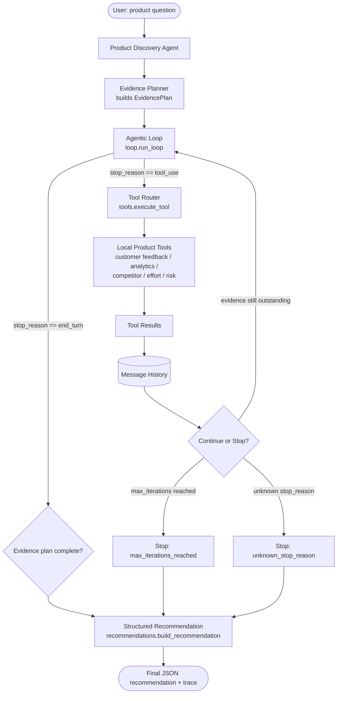
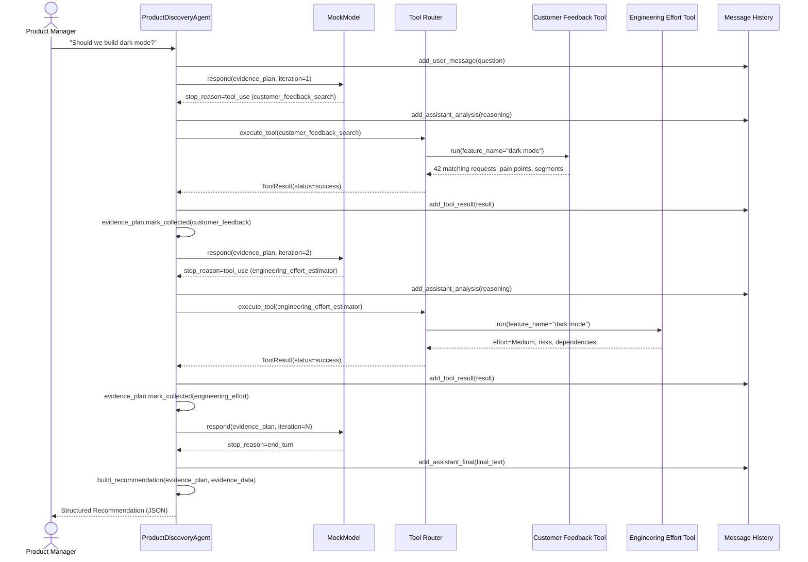

# Architecture

The Product Discovery Agent is built around one idea: **a recommendation is
only as good as the evidence behind it**. Every module in this project exists
to make that evidence-gathering process explicit, inspectable, and safe to
stop.

## High-level flow

```
User
  ↓
Product Discovery Agent
  ↓
Evidence Planner
  ↓
Agentic Loop
  ↓
Tool Router
  ↓
Local Product Tools
  ↓
Tool Results
  ↓
Message History
  ↓
Continue or Stop Decision
  ↓
Structured Recommendation
```

See [architecture.mmd](architecture.mmd) for the same flow as a Mermaid
flowchart, reproduced here:



## Module responsibilities

| Module | Responsibility |
|---|---|
| `app.py` | CLI entry point: scenario/interactive selection, flags for bug modes and demos. |
| `src/agent.py` | Owns the `ProductDiscoveryAgent`: resolves the feature, builds the evidence plan, executes tools, applies retry policy, and wires in the bug-mode demonstrations. |
| `src/loop.py` | The generic agentic loop (`run_loop`): reads `stop_reason`, dispatches to tool execution, enforces the max-iteration cap. Framework-agnostic - it doesn't know what a "feature" or "evidence type" is. |
| `src/mock_model.py` | Deterministic stand-in for an LLM. Given the current `EvidencePlan`, decides whether to request tool(s) or return `end_turn`. No network calls, no randomness. |
| `src/models.py` | Pydantic schemas: messages, tool calls/results, evidence plan, final `Recommendation`. |
| `src/history.py` | Append-only structured message history; renders a readable trace and exports JSON. |
| `src/tools/*.py` | The five local mock tools, each reading its own synthetic JSON dataset. |
| `src/recommendations.py` | Deterministic, explainable rules that turn collected evidence into a `Recommendation`. |
| `src/data_loader.py` | Loads synthetic JSON datasets and resolves free-text feature names to dataset keys. |

## Why the loop is split into `loop.py` and `agent.py`

`loop.py` implements only the control flow every tool-using agent needs:
read a response, branch on `stop_reason`, and enforce an iteration cap. It
has no knowledge of "evidence types" or "product features" - that keeps it
reusable and easy to reason about in isolation.

`agent.py` supplies the one callback the loop needs (`on_tool_use`) and owns
everything domain-specific: which tool maps to which evidence type, how
retries work, and how the two bug modes intentionally break the contract.
This separation is also what makes the bug-mode demonstrations clean: they
only ever touch `agent.py`, never the loop itself.

## Sequence diagram: two tool calls before the final answer

The diagram below shows a shortened run (only two evidence types) to keep it
readable; a real run pulls in up to five before returning `end_turn`.



## Stopping conditions

The loop can end in exactly one of five ways, each mapped to a distinct
`stop_reason` string surfaced in the CLI and in `AgentRunResult.stop_reason`:

1. `end_turn` - the evidence plan is complete (or all outstanding items were
   permanently given up on after retries); a full recommendation is produced.
2. `unknown_stop_reason` - the (simulated) model returned a stop reason the
   loop doesn't recognize; the loop halts safely instead of guessing.
3. `max_iterations_reached` - the iteration cap was hit before the plan
   completed; the loop stops instead of running forever.
4. `bug_mode_end_too_early` - only produced when `--bug-mode end-too-early`
   is active; demonstrates what happens when a loop returns after the first
   tool call instead of continuing.
5. Tool-level failures never stop the loop by themselves - a failed tool
   call is retried once, and only marked permanently failed (removed from
   the outstanding list) if the retry also fails.
